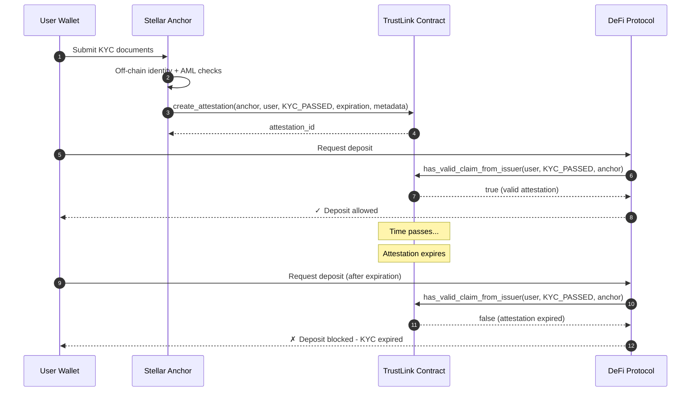

# Stellar Anchor Integration Example

This example demonstrates a complete end-to-end anchor-driven KYC flow using TrustLink:

1. **Anchor Registration**: Anchor is registered as a trusted issuer by the admin.
2. **Off-Chain KYC**: User completes KYC verification with the anchor.
3. **Attestation Issuance**: Anchor creates an on-chain `KYC_PASSED` attestation for the user.
4. **DeFi Verification**: DeFi protocol verifies the attestation before allowing deposits.
5. **Expiration Handling**: When KYC expires, deposits are blocked until renewed.

## Full Flow Overview



## Prerequisites

- Node.js 20+
- Anchor and DeFi test accounts funded on Stellar testnet
- TrustLink deployed and initialized
- Anchor already registered by admin with `register_issuer`

## Setup

```bash
cd examples/anchor-integration
npm install
cp .env.example .env
```

Set real values in your shell (or use your preferred env loader):

```bash
export RPC_URL="https://soroban-testnet.stellar.org"
export NETWORK_PASSPHRASE="Test SDF Network ; September 2015"
export TRUSTLINK_CONTRACT_ID="CDLZFC3SYJYDZT7K67VZ75HPJVIEUVNIXF47ZG2FB2RMQQVU2HHGCN8"
export ANCHOR_SECRET="S..."
export USER_ADDRESS="G..."
export DEFI_CALLER_SECRET="S..."
```

## Run

```bash
npm start
```

The script performs:

- `is_issuer(anchor)` to confirm anchor authorization
- `create_attestation(anchor, user, "KYC_PASSED", expiration, metadata)`
- `has_valid_claim_from_issuer(user, "KYC_PASSED", anchor)` as a DeFi gate

## Expected Output

The script performs the following steps:

1. **Verify Anchor Registration**: Checks if anchor is registered as issuer
2. **Simulate Off-Chain KYC**: Logs user KYC completion
3. **Create Attestation**: Issues `KYC_PASSED` attestation with 180-day expiration
4. **DeFi Verification**: Verifies attestation is valid (should return `true`)
5. **Check Attestation Status**: Queries current status and explains expiration behavior

Example output:
```
=== ANCHOR INTEGRATION FLOW ===

1) Anchor issuer registration check
✓ Anchor registered as issuer: true

2) User completes KYC off-chain
✓ User submitted KYC documents
✓ Anchor verified identity and compliance

3) Anchor issues KYC_PASSED attestation
✓ Created attestation id: att_abc123...
✓ Attestation expires at: 2026-10-23T18:44:40.983Z

4) DeFi contract verifies attestation before allowing deposit
✓ DeFi verification result: true
✓ Action: ALLOW deposit - user has valid KYC attestation

5) Simulate KYC expiration scenario
⏱ Checking attestation status...
✓ Current attestation status: Valid
✓ Attestation is currently valid
⏱ After expiration date, status will become 'Expired'
✗ DeFi contract will then DENY deposits until KYC is renewed

=== FLOW COMPLETE ===
```

## Mapping to Production

- Move KYC verification logic to your anchor backend service.
- Keep only hash/reference metadata on-chain; store PII off-chain.
- Use issuer-specific checks in regulated protocols:
  - `has_valid_claim_from_issuer` for strict trust policies
  - `has_valid_claim` for broader trust sets
- Add revocation monitoring and expiration renewal workflows.
- Implement webhook notifications when attestations are about to expire.
